# Onyx V1 — Build Documentation

## System Overview

| Subsystem | Description |
|-----------|-------------|
| Microcontroller | Pi Pico |
| Communication | Bluetooth (HC-05 module, Android phone control) |
| Power | Mobile phone power bank |
| Enclosure | Acrylic tube + custom acrylic lids, O-ring seals |
| Ballast | 60ml syringe-based, lead shot pouch, servo/manual actuation |
| Propulsion | 6x DC geared motors (Gebildet, double axis 1:48), intended for props and syringe drive |

---

## Parts List

**Hull:**
- Clear extruded acrylic plastic perspex tube (250mm length, 110mm OD / 104mm ID)
- Lids cut from smaller diameter acrylic tube and 3mm clear acrylic perspex sheet (300mm x 300mm, polished edges)
- Pair of small magnets attached to one lid for the propeller system

**Ballast:**
- 2kg lead shot pouch (vintage, in IKEA sandwich bag)

**Valve:**
- 1/8" NPT solid brass air compressor tank fill Schrader valve (2pcs)

**Ballast Syringe System:**
- 60ml hydroponics syringes (2pcs)
- Clear PVC tubing (8mm ID x 10mm OD, 0.5m)

**Seals:**
- Solid nitrile rubber O-ring cord, 2mm cross section (3x)
- Loctite 206 adhesive for bonding O-ring cord ends

**General Assembly:**
- Various LEGO pieces (spec to be provided)
- Zip ties and elastic bands

**Electronics:**
- Mobile phone power bank
- Micro USB cable
- Pi Pico
- HC-05 Bluetooth Serial Transceiver (paired with Android phone and SerialConnector app)
- 3x DRV8833 1.5A 2-channel H-Bridge DC gear motor driver modules
- 6x Gebildet DC3V-12V prewired geared motors (double axis 1:48, for syringe and props)
- Custom soldered PCB

---

# Hull Construction

This section documents the construction of the hull, with images and descriptions for each step and component.

## Overview

The hull consists of a clear cylindrical tube and two custom-fabricated lids. The lids are designed to seal the ends of the tube and provide access for additional components.

### Components

- **Tube:** Transparent, forms the main body of the hull.
- **Lids:** Two square acrylic plates with circular cutouts and attached rings to fit inside the tube.
- **Valve:** One lid is fitted with a Schrader valve for pressure control.
- **Magnets:** A pair of small magnets are attached to one lid, intended for use in the propeller system. Their resistance to corrosion is being monitored.
- **Seals:** O-rings are used to ensure a watertight fit between the lids and the tube.

---

## Images

### Hull Tube and Lids

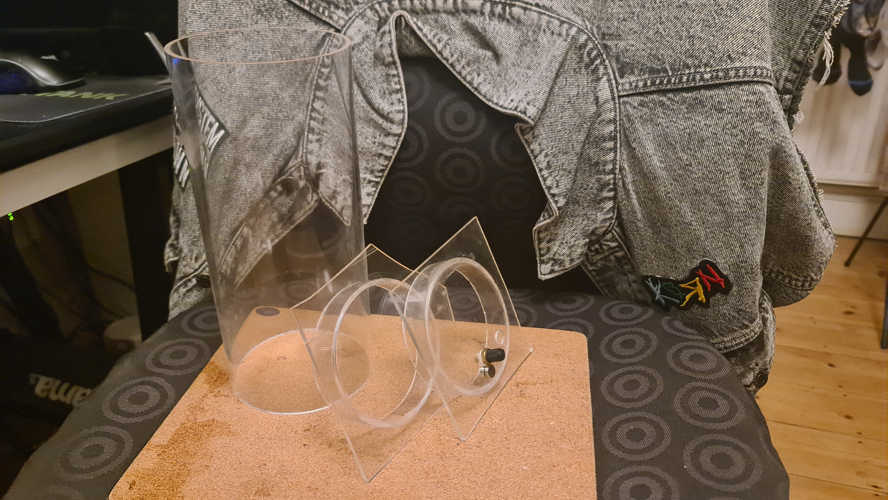
*The clear cylindrical tube and both lids. The lids are square acrylic plates with circular rings attached, designed to fit snugly inside the tube.*

### Lids Close-Up (No Seals)

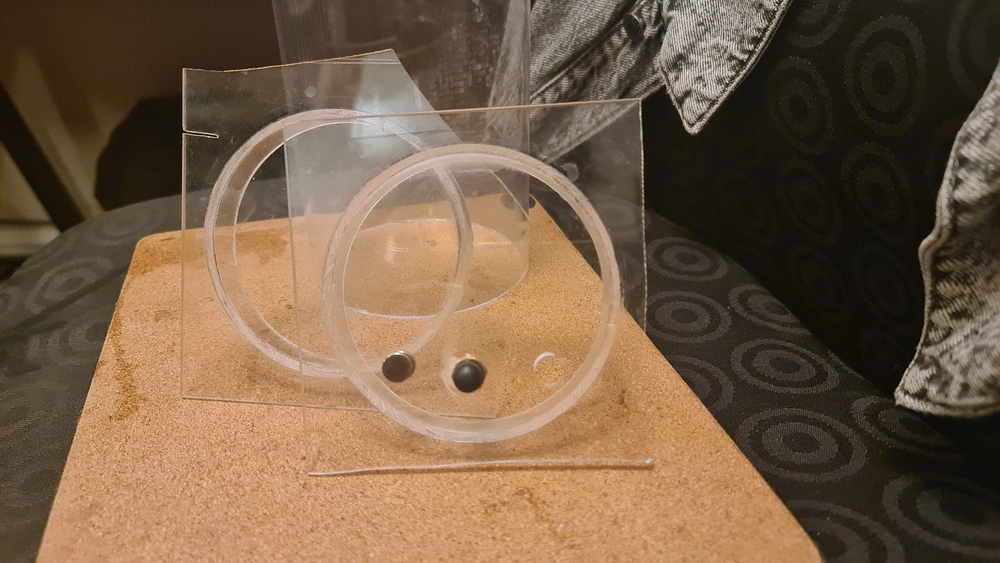
*Close-up of the two lids. The right lid has a Schrader valve embedded for pressure control. A pair of small magnets are also visible, which are being considered for the propeller system. Their condition is monitored for corrosion due to exposure to water.*

### Lids Close-Up (No Seals, Top View)

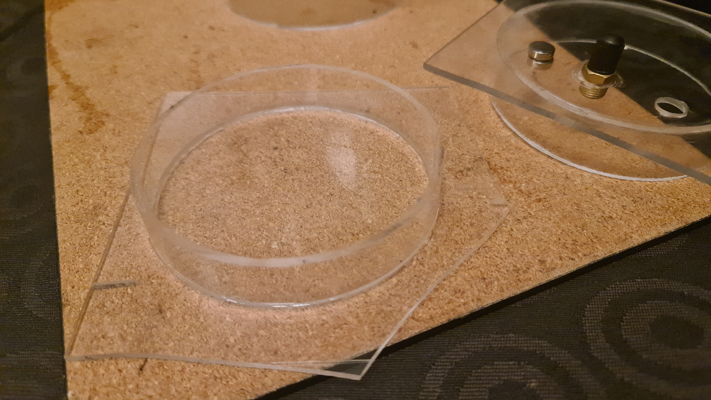
*Another angle showing the lids without seals. The Schrader valve and magnets are visible.*

### Lids with Seals

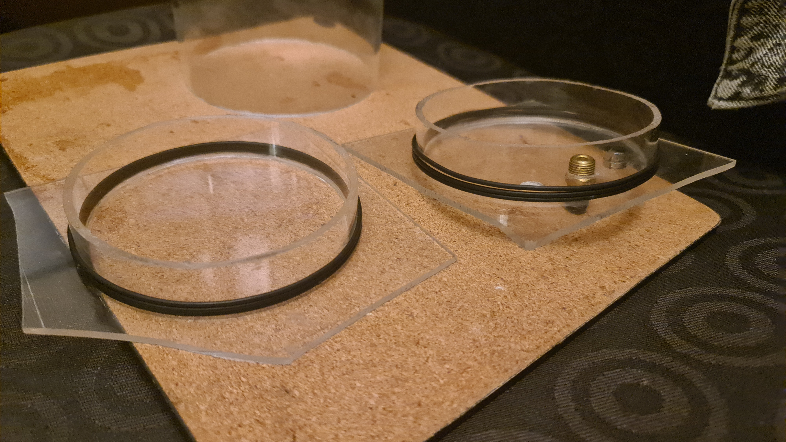
*Both lids fitted with O-ring seals, ready to be inserted into the tube for a watertight fit.*

---

## Waterproofing Approach

### V1 Method

- Primary seal: [TBC — original approach]
- Secondary: [TBC]
- Known weaknesses: seal reliability unconfirmed under pressure

### Updates During V1

- Nitrile glue ordered as replacement/improvement
- [Note any cable entry points and how they were sealed]

### What Was Not Done

- No pressure testing at depth
- No validated seal protocol

---

## Issues

### Flat Panel Lids — Cutting Difficulty

The flat acrylic panels were difficult to cut accurately. A hacksaw was used but proved hard work and incapable of cutting to a precise shape, so the lids were left in their roughly cut form rather than being trimmed to a cleaner finish.

The roughly cut acrylic edges were also sharp enough to cause injury during handling.

### Schrader Valve — Not Properly Sealed

The Schrader valve's intended role was to relieve excess pressure when pushing the lids on. Later its role expanded: the plan was to open the valve and pull the syringe all the way out, allowing excess air to escape, so that when the syringe was pushed back in, the vessel would be at low pressure. This would:
- (a) help keep the lids on, and
- (b) prevent increased internal pressure on the lids when submerged with the syringe extended.

However, the valve was not properly sealed. While it did not appear to let water in, it did allow gas to pass during syringe operation — a stream of bubbles was observed during testing when the syringe was being drawn out.

### Syringe Tube Hole — Worked Well

The hole in the same lid for the syringe tube performed surprisingly well, remaining sealed simply by the presence of the tube inserted through it. No additional sealing was needed.

For hull-only buoyancy testing, this hole becomes an open penetration because the syringe and tube are removed. It must be temporarily blocked before submersion so the test measures hull buoyancy rather than water ingress through the unused tube path. The blocking method should be recorded in the test entry.

### O-Ring Seals — Ongoing Point of Failure

Getting the seals right proved difficult throughout, and they remained a point of failure during testing, allowing water ingress. Key issues:

- **Thickness:** The gap between the inner and outer hull is 2mm — the difference between the inner diameter of the outer tube (104mm) and the outer diameter of the inner tube — so a slightly thicker seal was desired so it would compress to a tight fit when stretched. The closest available was 2.3mm cord, but stretching it far enough to lose 0.3mm of thickness proved too much for any adhesive tested. The 2mm cord was ultimately used, which felt snug but may not have provided sufficient compression.
- **Adhesive:** Loctite 206 was the clear winner for bonding the seal cord ends.
- **Alignment:** Gluing the seals straight around the lid was very difficult, and the joins are likely to have been points of failure.
- **Quantity:** Three O-rings were used per lid precisely because at 2mm thickness the contact surface area was small, meaning a single ring did not provide enough grip to keep the lid seated in the tube.

---

## Next Build — Hull Improvements

- [ ] **Lid cutting:** Use a laser cutter or CNC router to cut the flat acrylic panels accurately to shape, rather than a hacksaw. This would allow proper circular or hex profiles that fit the tube cleanly.
- [ ] **Acrylic edge safety:** Smooth or deburr all cut acrylic edges before handling and assembly. Wear gloves when handling freshly cut or rough acrylic parts.
- [ ] **Schrader valve sealing:** Properly seal the valve into the lid using thread sealant (e.g. PTFE tape + Loctite) or a rubber-backed nut on the reverse side. Pressure-test before assembly to confirm it holds gas.
- [ ] **Schrader valve alternative:** Consider replacing with a simple one-way check valve or a plug with a bleed hole that can be temporarily blocked with a finger — simpler and less likely to leak.
- [ ] **O-ring groove:** Machine or laser-cut a shallow groove into the lid at the correct diameter to locate the O-ring precisely and keep it straight during fitting, rather than relying on gluing cord freehand.
- [ ] **O-ring cord thickness:** The gap is a known 2mm (defined by the tube dimensions). Source 2.5mm or 3mm nitrile cord and test whether it can be stretched to fit without adhesive failure.
- [ ] **O-ring joins:** Experiment with vulcanising O-ring cord joins (heated tool method) rather than adhesive, which would produce a stronger, more uniform join with no raised bead.
- [ ] **Lid retention:** Investigate adding a positive locking mechanism (e.g. a twist-lock lip, a retaining ring, or a threaded end cap) so the lids are mechanically retained as well as sealed, removing reliance on O-ring friction alone.
- [ ] **Magnets:** Assess corrosion on the existing magnets after water exposure. If corroded, replace with coated or stainless-backed alternatives. Consider whether a magnetic coupling is the right approach for the propeller system or whether a shaft seal would be more reliable.
- [ ] **Pressure testing:** Before any water testing, perform a bench pressure/vacuum test on the sealed hull to confirm all seals hold — e.g. pressurise slightly and check for pressure loss over time, or submerge in a container and look for bubbles.
- [ ] **Waterproof testing:** Perform dedicated water-ingress tests on the assembled hull before fitting electronics or running open-water trials. Test progressively with longer submersion times and inspect the inside for any moisture after each test.

---

# Internal Chassis Assembly

## Overview

The internal chassis is a LEGO Technic frame that slides in and out of the hull tube as a single removable unit. It carries all functional subsystems: the ballast actuator, the propulsion motors, the electronics, and the power bank. The modular design means the entire mechanism can be extracted, worked on, and reinserted without disturbing the hull or seals.

---

## Images

### Side Profile — Full Assembly

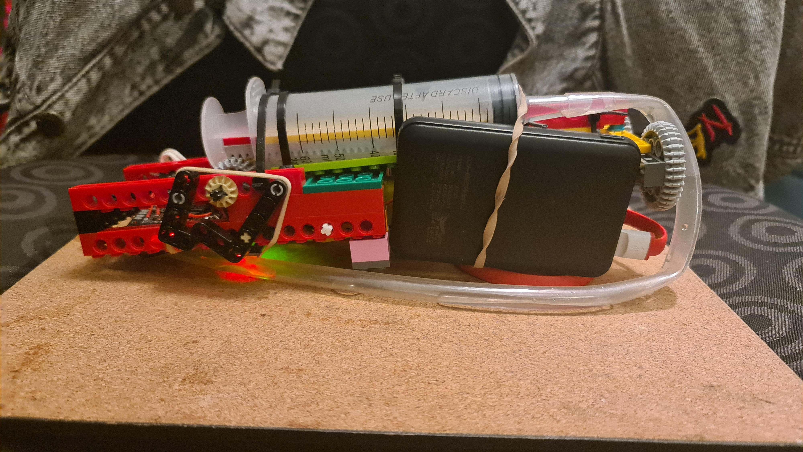
*Side view of the complete internal assembly removed from the hull. The large 60ml ballast syringe runs along the centre. The phone power bank (black rectangle) is strapped to the right half. The ballast actuator motor and gear train are visible on the left, alongside the electronics board. The propulsion end with gear reduction is at the far right.*

---

### Plan View — Top Down

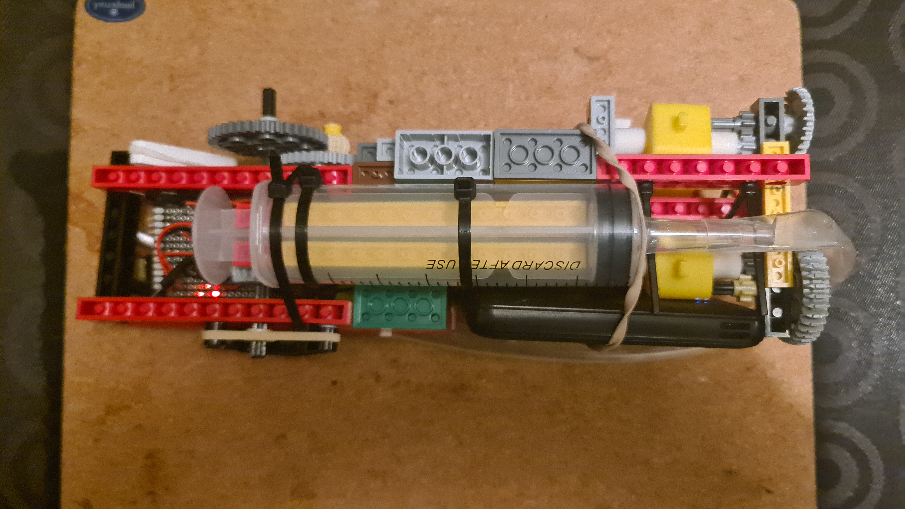
*Top-down view of the full assembly. The custom PCB/stripboard is at the far left. The syringe dominates the centre, retained with zip ties. The power bank sits below. At the far right, the propulsion gear train and thruster motors are visible. The overall layout shows how the subsystems are arranged along the fore-aft axis.*

---

### Aft End — Propulsion Assembly

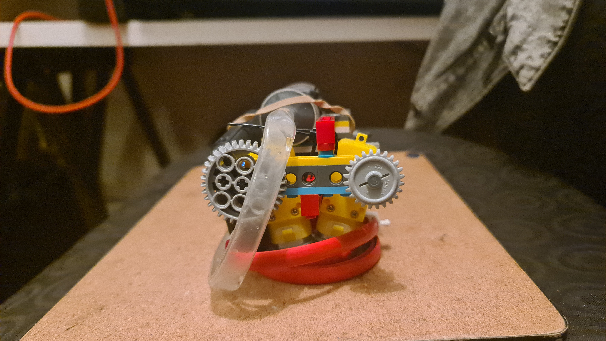
*View from the aft (stern) end of the chassis. The grey LEGO gear reduction stage and thruster coupling are prominent. The syringe piston cap is visible at the top. The yellow propulsion motors are also visible.*

---

### Bow End — Syringe Piston and Wiring

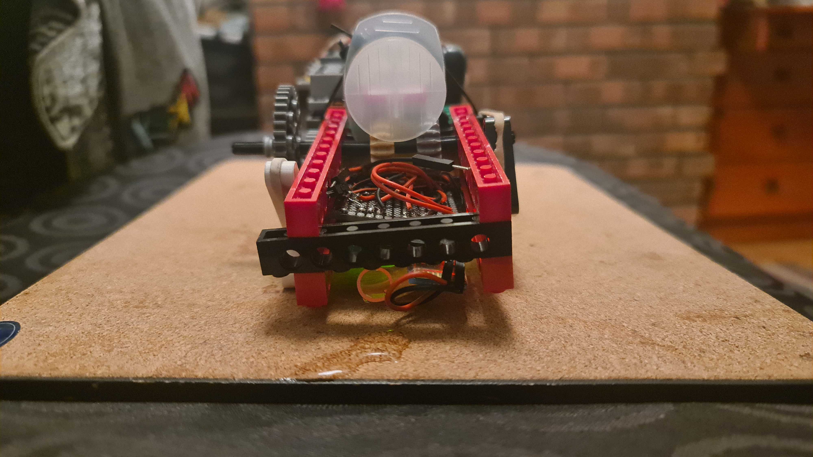
*View from the bow end. The syringe piston (white/clear dome) faces forward. The LEGO frame structure is visible on both sides. Below, the wiring harness and a lateral thruster can be seen.*

---

### Underside View — Electronics and Propulsion Visible

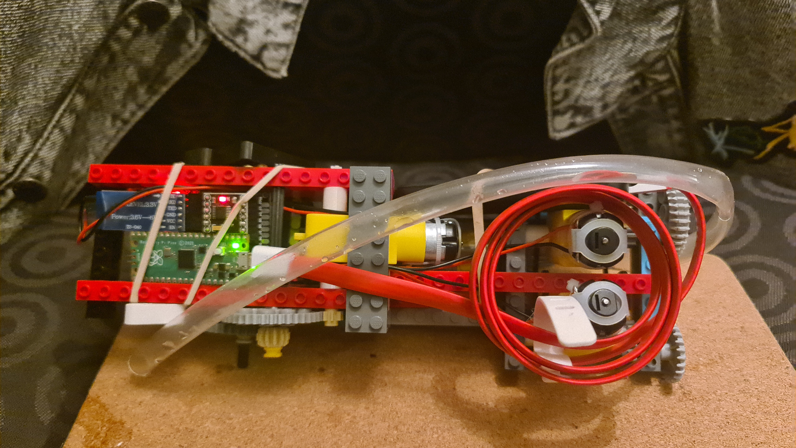
*Side view showing the full length of the chassis. The Pico and HC-05 Bluetooth board are visible on the left. The clear PVC ballast tube runs from the syringe nozzle, looping over the chassis and connecting to the hull lid. The fore/aft and lateral thruster motors with their gear stages are visible on the right. Visible water droplets indicate this was photographed following a test.*

---

### Close-Up — Ballast Actuator and PCB

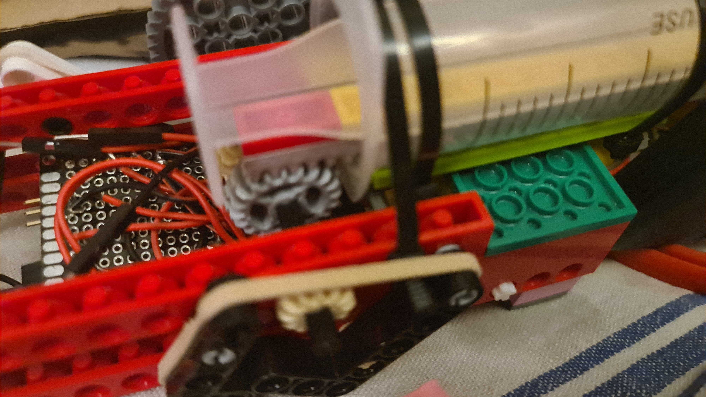
*Close-up of the ballast actuator subsystem and the custom PCB. The DC motor drives a LEGO bevel gear, which transfers torque to the syringe plunger mechanism. The stripboard PCB with pin headers and jumper wiring is visible to the left. The syringe barrel runs across the top of the frame.*

---

## Issues

### Component Attachment — No Proper Mounting Solution

No good method was found for attaching the electronics, power bank, or USB cable to the chassis. Elastic bands were used as a temporary solution throughout. This is clearly unsuitable for a wet environment and introduced unreliability when the assembly was repeatedly inserted and removed from the hull.

### LEGO Frame Integrity Under Ballast Load

LEGO parts were used to brace the frame against the forces generated by operating the ballast syringe actuator. This generally held, but failures were frequent enough that zip ties were ultimately added to reinforce the critical joints. The zip ties helped, but the compressive forces they introduced sometimes pulled other parts of the frame out of alignment.

### Syringe Travel Limit — Only Half Capacity Used

The physical layout of the chassis constrained the plunger travel to roughly half the syringe's 60ml capacity. Over-travel in either direction risked pushing a hull lid off or stripping the drive gears.

As a software workaround, the Pico used a timed pulse to stop the motor after a fixed duration. This is fragile — timing-based motor stops are sensitive to voltage variation and load changes. The correct solution is a physical end-stop (e.g. a microswitch or push button) in both the fully-extended and fully-retracted positions, cutting power to the motor when the plunger reaches its limit.

A possible alternative is to use two smaller syringes side by side, each able to be fully utilised, increasing total displacement within the same spatial envelope.

### Ballast Tube Routing

The syringe tube had no clean path to the outside of the hull and had to double back through the interior, creating a long internal run with bends. Kinking was a concern, though it did not appear to significantly restrict water flow during testing.

The tube contained a column of air when the syringe was in the retracted position. This meant water did not fill the syringe directly — the air had to be displaced first. The assumption is that the displaced volume was equivalent regardless, but this has not been verified and should be measured.

### Propulsion — Magnetic Coupling Not Implemented

The intended design was for magnets to be embedded in the internal propulsion gears, with magnetically-coupled external propeller hubs sitting on the outside of the hull wall, driven without any shaft penetration. This would have avoided any need for a rotating seal through the hull.

This was not implemented in V1. The prop drive remained theoretical throughout the build.

### 3D-Printed Motor Adapters — Shout-Out

The motors could not be directly coupled to LEGO gears without a custom adapter. A friend, Drew, 3D-printed the interface pieces that connected the motor shafts to LEGO-compatible gear hubs. These worked well and were a key enabler for the ballast actuator mechanism.

### Ballast Actuator — Performed Well, Gearing Was Guesswork

The syringe ballast system performed its role reliably and consistently — the standout mechanical success of V1. The gear reduction ratio was selected by trial and error rather than calculation. A proper force analysis of the syringe under water pressure should be done to determine the required torque and specify the gear ratio correctly, reducing the risk of motor or gear failure and improving efficiency.

### USB Cable — Clearly Unsuitable

The USB cable supplying power from the power bank to the Pico was a standard off-the-shelf cable used as a stopgap. It was not strain-relieved, not retained mechanically, and added considerable bulk and awkward routing inside the chassis.

### Overall Size — Too Large

The assembled chassis was too large. Inserting and removing it from the hull tube was difficult and required care not to disturb the wiring or the ballast tube. The whole mechanism needs a significantly smaller footprint in V2 to allow practical use.

---

## Next Build — Internal Chassis Improvements

- [ ] **Component mounting:** Design proper mounting points for the power bank, PCB, and cable management into the chassis structure from the outset. Avoid elastic bands or improvised retention.
- [ ] **Frame rigidity:** Design the chassis to be inherently rigid under actuator load. If LEGO is retained, use a cross-braced structure and plan fastener positions before assembly. Consider whether a non-LEGO (e.g. 3D-printed or CNC) chassis would be more practical.
- [ ] **Plunger end-stops:** Fit microswitches or push buttons at both ends of the syringe plunger travel to provide hard electrical cutoffs. Remove reliance on timed pulses for motor stop.
- [ ] **Syringe sizing:** Consider replacing the single 60ml syringe with two smaller syringes mounted side by side, each fully usable, to increase total displacement capacity and reduce peak actuator force.
- [ ] **Ballast tube routing:** Design a direct, low-bend path for the ballast tube from the syringe to the hull penetration point. Use a bulkhead fitting or smooth gland on the lid to eliminate the internal loop.
- [ ] **Ballast force calculation:** Measure or calculate the force required to operate the syringe at depth and use this to properly specify the gear ratio, motor, and driver current limit.
- [ ] **Magnetic propulsion coupling:** Prototype the magnetic drive coupling concept — embedded magnets in internal gears, external propeller hubs magnetically coupled through the hull wall — to determine whether it is viable as a shaft-seal-free drive system.
- [ ] **USB cable replacement:** Replace the USB power cable with a short, appropriately rated direct connection. Consider the connector type, strain relief, and routing at design time.
- [ ] **Chassis footprint:** Reduce the overall footprint of the internal assembly so it can be inserted and removed from the hull tube with one hand, without disturbing other components.

---

# Electronics

## Overview

The electronics assembly consists of three core components mounted on a custom-built LEGO frame, with a phone power bank providing power via USB:

| Component | Role |
|-----------|------|
| Raspberry Pi Pico | Microcontroller — all logic and motor control |
| HC-05 Bluetooth module (ZS-040) | Wireless communication, paired with Android phone via SerialConnector app |
| DRV8833 dual H-bridge motor driver | Drives up to 2 DC motors at up to 1.5A per channel |

All components were fitted with pin headers and sockets so that every module can be removed and reused independently without desoldering. This worked well in practice.

---

## Photo

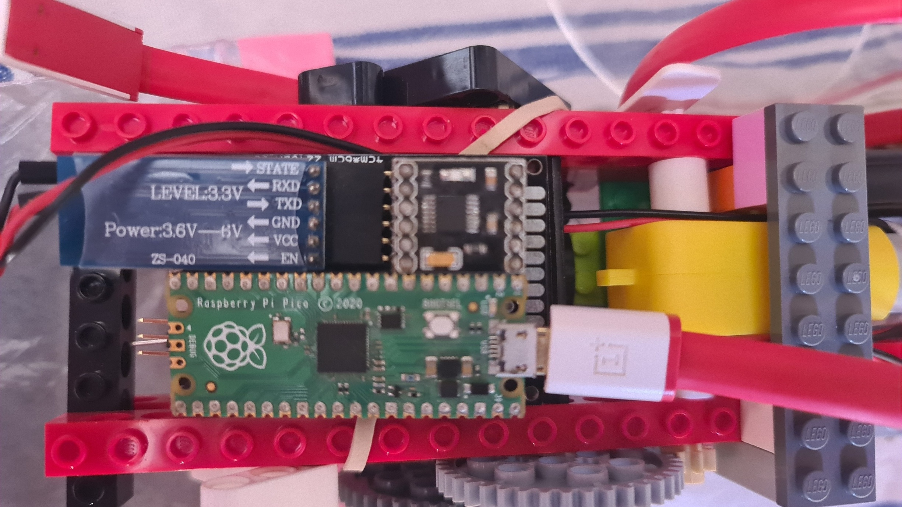
*Electronics mounted inside the LEGO chassis. Left: Raspberry Pi Pico. Right (top): HC-05 Bluetooth module (ZS-040). Right (bottom): DRV8833 motor driver. A phone power bank is visible below, connected via USB.*

---

## Issues

### Manual PCB — Functional but Messy

A custom PCB was hand-soldered to connect the components. While it worked, the process was fiddly and the result was untidy. Reliability concerns remain around borderline solder joints, and any rework would be difficult.

### Bluetooth Is Not Suitable for Live Submerged Control

The HC-05 Bluetooth link was useful for bench testing, surface commands, and RC control in air, but it was not suitable for real-time control once the submarine was submerged. As soon as the submarine submerged, the Bluetooth connection was immediately lost, so live remote control was unavailable for the duration of a dive.

Bluetooth was still a net advantage for V1 because it allowed a smartphone to act as the controller. That kept the control hardware simple and let the build focus on the vehicle rather than on a separate transmitter. Replacing Bluetooth with an underwater-capable radio link will also mean building or adapting a dedicated controller, not just swapping the receiver inside the submarine.

**Workaround applied:** The control logic was modified to operate autonomously. On command, the sub would dive, hold for 10 seconds, then resurface. This avoided the need for an active connection during submersion and was sufficient for V1's submersion experiments.

### Motor Driver — Insufficient Channel Count

The DRV8833 provides 2 independent motor channels. Three were required:

| Motor axis | Role |
|------------|------|
| Ballast actuator | Drives the syringe piston to control buoyancy |
| Fore/aft thruster | Longitudinal propulsion |
| Lateral thruster | Transverse (side-to-side) propulsion |

Only two of the three axes could be driven at once with the hardware fitted, limiting manoeuvring capability.

### Battery — Not Fit for Purpose

The mobile phone power bank was available and convenient but is not appropriate for this application:

- Power banks automatically cut output at low current draw (interpreting it as the device being fully charged), causing unexpected resets during low-power operation.
- Capacity, discharge rate, and voltage regulation are optimised for phone charging, not motor drive loads.
- No power budget was established before the build, so actual requirements were unknown.

Battery selection needs to be properly revisited for V2.

### Motor Capability — Unknown

No datasheet was available for the Gebildet DC geared motors. Stall current, no-load current, torque, and rated speed were all unknown going into the build. As a result:

- PWM duty cycles and drive parameters were effectively guesses.
- The motors may have been running well outside their optimal operating range.
- Power draw and efficiency are uncharacterised; the risk of motor or driver damage from over-driving is non-trivial.

---

## Next Build — Electronics Improvements

- [ ] **PCB design:** Replace the hand-soldered PCB with a properly designed board. Use a PCB design tool (e.g. KiCad) to plan the layout before committing. At minimum, use well-laid-out stripboard with a clear schematic.
- [ ] **Communication technology:** If live submerged control is required, replace Bluetooth with an underwater-capable alternative. Options to investigate include an appropriate low-frequency radio approach, a wired tether for short-range testing, or acoustic communication for a more conventional underwater-vehicle path.
- [ ] **Motor driver channel count:** Use a driver combination supporting at least 3 independent channels (e.g. two DRV8833 modules, or a single board with 3+ channels).
- [ ] **Power budget:** Before selecting a battery, measure current draw of all motors under representative load using a bench supply and multimeter. Sum the draw, add margin, and use this to specify battery capacity and continuous discharge rating.
- [ ] **Battery selection:** Based on the power budget, select an appropriate LiPo or similar battery. Confirm it can deliver sufficient peak current without triggering a low-current cutoff. Add a low-voltage alarm or cutoff to protect the pack.
- [ ] **Motor characterisation:** Source datasheets or, if unavailable, characterise the motors on the bench — measure no-load current, stall current, and approximate torque at operating voltage. Use this to set appropriate drive parameters and confirm the motor driver stays within its rated limits.
- [ ] **Wiring tidiness:** Document and label all connections. Use consistent wire colours and lengths. Ensure all connectors are mechanically retained and will not vibrate loose during operation.

---

# Full Assembly

This section shows the complete submarine — internal chassis loaded into the hull tube, with both lids in place.

---

## Images

### Plan View — Chassis Inside Hull

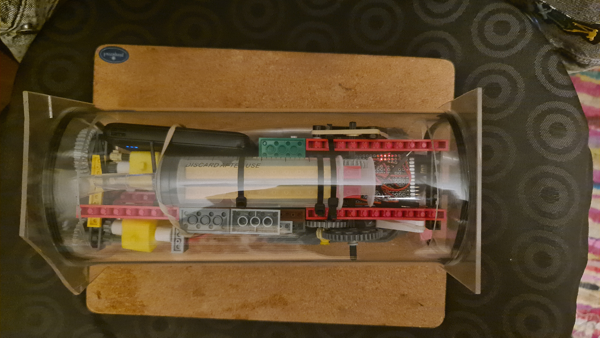
*Top-down view of the internal chassis seated inside the clear acrylic hull tube. The syringe runs along the centre axis. The power bank is visible to the left, the PCB to the right. The lid panels extend beyond each end of the tube.*

---

### Bow End — Lid and Internal Components

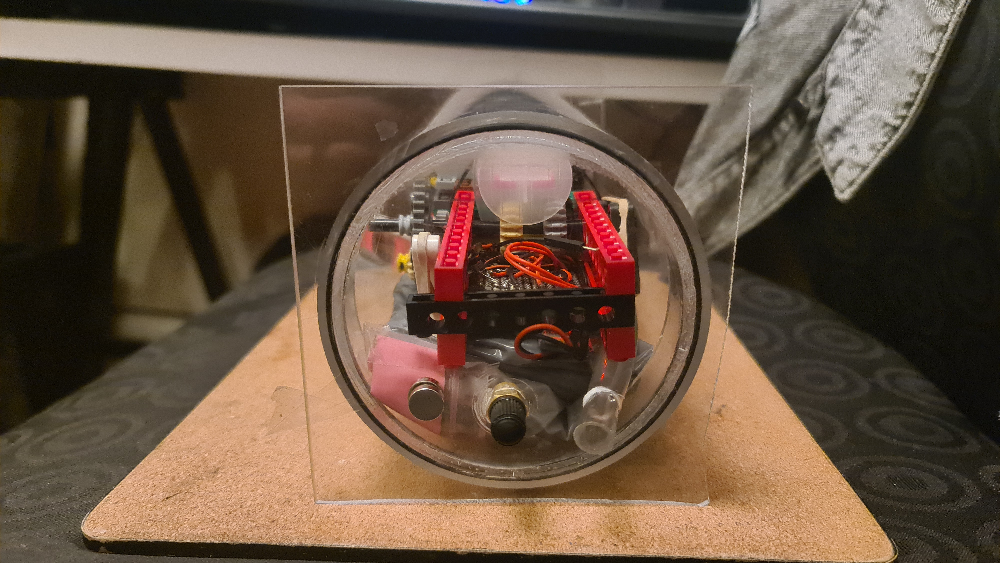
*View into the bow end of the assembled hull. The flat acrylic lid is in place, with the Schrader valve and syringe tube penetration visible at the bottom. The syringe piston dome protrudes from the chassis. The LEGO frame, wiring, and lead shot ballast pouch are visible inside the tube.*

---

### Aft End — Propulsion Gear Train Through Hull

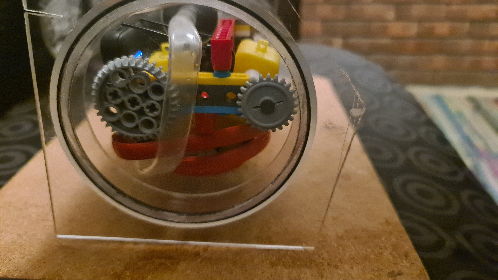
*View into the aft end of the assembled hull. The propulsion gear reduction stage is prominent, with the large LEGO turntable gear and smaller driven gear visible. The yellow motor mounts and red LEGO frame structure are visible behind. The ballast tube loops around the inside of the tube.*

---

### Side View — Complete Submarine

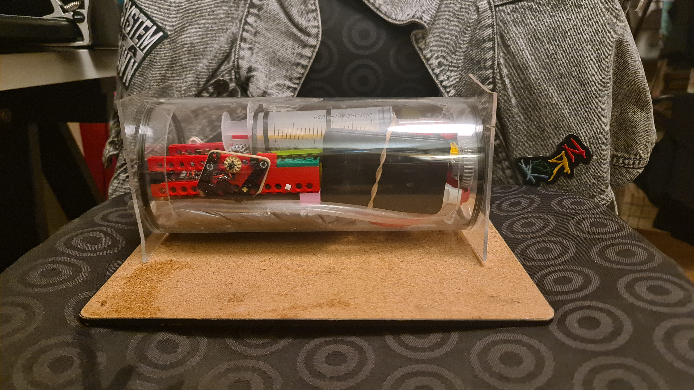
*Side view of the complete assembled submarine on the test board. The ballast actuator and electronics occupy the left (bow) end, with the motor driver board visible through the clear tube wall. The power bank and syringe fill the centre. The propulsion gear train is visible at the right (aft) end.*

---

## Issues

### Ballast Distribution — Uneven, Causing Tilt

With the internal chassis filling most of the tube diameter, there was no practical way to distribute the lead shot ballast evenly around the centre of gravity. The weight ended up unevenly placed, causing the submarine to tilt rather than sit level in the water.

---

## Next Build — Full Assembly Improvements

- [ ] **Ballast floor:** Design a dedicated floor panel that sits at the bottom of the hull tube. All ballast (lead shot or equivalent) is packed below the floor, evenly distributed along the length. The internal chassis sits on top of the floor, keeping ballast and mechanism separate and the weight low and centred.
- [ ] **Chassis clearance:** Size the chassis to slide in and out of the hull easily without needing to manipulate ballast or wiring — leave adequate clearance around the frame for practical handling.

---

# Annex / Notes

---

## Power System

| Parameter | Value |
|-----------|-------|
| Battery type | Mobile phone power bank |
| Capacity | 500mAh |
| Voltage | 5V (USB output) |
| Estimated runtime | [TBC — not measured] |
| Charging method | Standard USB recharge |
| Low-power measures | None (see notes) |

**Notes:**
- Power supplied via USB from a mobile phone power bank for ease of use and recharging.
- The Pi Pico and all electronics powered from USB 5V.
- **Issue:** If the unit was drawing very little current (e.g., idle or only Pico running), the power bank would automatically switch off, likely assuming the "phone" was fully charged. This caused unexpected shutdowns during low-power operation.
- No additional low-voltage cutoff or protection circuitry was used.
- Power draw from motors vs. electronics was not profiled; runtime not measured.
