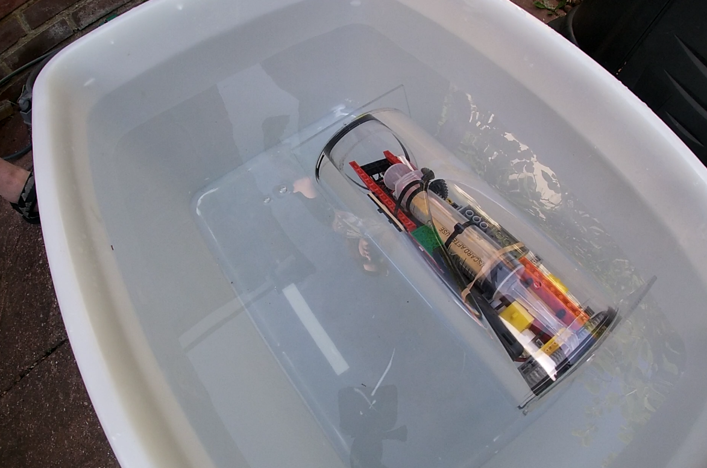

# Onyx V1 — Submersion Testing Record

This file records the water tests performed during V1 and the observations that should carry forward into V2.

Unlike the build notes, this is not a component-by-component design record. It is a practical test history: what was put in the water, what happened, and what that means for the next stage.

---

## Summary

The V1 submersion tests confirmed that the submarine could be assembled, sealed, placed in water, and actuated, but not with enough reliability or stability to continue developing V1 as a full RC vehicle.

The main outcomes were:

- Bluetooth control is not viable for live submerged RC with the V1 hardware; the connection is lost as soon as the unit submerges.
- This did not invalidate the V1 submersion tests because the firmware could command an autonomous dive, wait 10 seconds, and resurface without maintaining a link.
- The hull seal is not reliable enough for electronics-first testing.
- The Schrader valve did not seal gas properly during syringe operation.
- The syringe ballast mechanism itself was mechanically promising.
- Ballast distribution and internal layout produced poor balance.

V1 should therefore not be used for further live RC-control development in its current hardware configuration. It can still be used as a controlled physical measurement platform before V2, especially for buoyancy, density, ballast, centre-of-mass, and syringe-actuation questions.

---

## Test Record

### T1 — Initial Powered Submersion

*The Onyx shortly after being placed in the water for the first time. You can see the heavy listing, which was largely due to difficulty distributing the ballast effectively as a result of generally cramped conditions on board.*

**Date:** [08/04/2026, 17:50 BST]

**Goal:**
Confirm whether the assembled submarine could be controlled while submerged.

**Setup:**
- Full V1 hull assembled with internal chassis installed.
- Pi Pico, HC-05 Bluetooth module, motor driver, power bank, ballast syringe, and lead shot ballast fitted.
- Control attempted from an Android phone using the SerialConnector app.

**Result:**
Although the syringe ballast could be actuated, the submarine did not dive below the surface.

**Observations:**
- The electronics and syringe actuator worked well.
- The submarine was listing heavily in the water.
- The syringe appeared around half full of air due to drawing it from the tube, it is still assumed that 40ml of water was successfully onboard, though this was not measured.
- The submarine was observed to be taking on water, which may have been due to the hull seal, the Schrader valve, or both.

**Conclusion:**
The definitive reason that the submarine did not submerge is not known, but the most likely cause is that the ballast was insufficient to overcome the buoyancy of the hull and internal components. The listing suggests that the ballast was also unevenly distributed, which would have made it harder to submerge.

**Issues to Carry Forward:**
- Must ensure ballast is sufficient to submerge the hull with all internal components installed.
- Must design the internal layout to allow for even ballast distribution.

---

### T2 — Autonomous Dive / Resurface Attempt

**Date:** [22/04/2026, 18:30 BST]

**Goal:**
To repeat the submersion test with the ballast more evenly distributed. 

**Setup:**
- As per test T1, but with the lead shot ballast distributed more evenly across the hull.

**Result:**
There was still some listing, but considerably less than T1, however, there was no improvement in the submarine's ability to submerge.

**Observations:**
- The submarine was more balanced than in T1, but still not level.
- The submarine did not submerge at all, even with the ballast syringe fully actuated.
- The submarine was observed to be taking on water, which may have been due to the hull seal, the Schrader valve, or both.
- The Schrader valve was observed to be leaking air when the syringe was actuated.

**Conclusion:**
The most likely reason that the submarine did not submerge is that the ballast was still insufficient to overcome the buoyancy of the hull and internal components. The listing suggests that the ballast was still unevenly distributed, which would have made it harder to submerge. The leaking Schrader valve may also have reduced the effective ballast.

**Issues to Carry Forward:**
- Must ensure ballast is sufficient to submerge the hull with all internal components installed.
- Must design the internal layout to allow for even ballast distribution.
- Must find a more reliable method of sealing the ballast water inside the hull, as the Schrader valve is not sufficient.

---

### T3 — Hull-Only Ballast Validation

**Date:** [Planned]

**Goal:**
Validate the displacement and ballast calculations using the sealed hull only, before reintroducing the internal chassis, electronics, motors, syringe, or power system.

#### Pre-Test Calculation

These are estimates based on nominal dimensions and assumed material density. Weigh the empty hull before the test and substitute the measured value for the acrylic estimate.

| Parameter | Value | Notes |
|-----------|-------|-------|
| Hull OD | 110 mm | From build spec |
| Hull ID | 104 mm | From build spec |
| Hull length | 250 mm | From build spec |
| Lid thickness | 3 mm | From build spec |
| Acrylic density | 1.18 g/cm³ | Standard extruded clear acrylic |
| Water density (fresh) | 1.00 g/cm³ | Tap water approximation |

**Displaced volume (outer cylinder only, not accounting for lid overhangs):**

V_displaced = π × (55 mm)² × 250 mm = **2,376 cm³**

This is the volume of water pushed aside — and therefore the maximum mass the hull can carry before sinking.

**Estimated hull mass (acrylic only):**

| Component | Volume | Mass |
|-----------|--------|------|
| Tube walls: π × (55² − 52²) × 250 mm | 252 cm³ | 298 g |
| Two lid plates: 2 × π × 55² × 3 mm | 57 cm³ | 67 g |
| Lid ring inserts, O-rings, Schrader valve, magnets | ~35 cm³ | ~40 g |
| **Total** | **~344 cm³** | **~405 g** |

**Predicted neutral-buoyancy ballast:**

m_ballast = V_displaced − m_hull = 2,376 − 405 ≈ **~1,970 g**

This is approximately the full 2 kg lead shot pouch. The volume of lead shot at that mass (~177 cm³ at 11.3 g/cm³) occupies only ~8% of the inner cavity, so packing is not a constraint.

Note: this figure will shift once the hull is weighed. A 50 g error in hull mass estimate shifts the required ballast by the same 50 g.

The syringe system (up to ~60 ml of water when working correctly) provides a further ~60 g of variable ballast on top of fixed lead shot. The goal for T3 fixed ballast should therefore be: the hull just barely floats with fixed ballast alone, so that admitting syringe water is enough to tip it into a slow, controlled descent.

---

**Setup:**
- Empty V1 hull assembled with both lids installed.
- Internal chassis, electronics, motors, syringe, and power bank removed.
- Syringe tube hole in the lid temporarily blocked before submersion. Record blocking method.
- Known ballast masses added progressively and distributed evenly along the hull length.

**Test Protocol:**

Before starting, weigh the empty hull and record below. Recalculate the predicted neutral-buoyancy ballast using the measured value.

Measured empty hull mass: _______ g
Recalculated ballast target: _______ g  (= 2,376 − measured mass)

Use the following phased approach. At each step: seal the hull, lower it into water, record the float state, then remove and add the next mass increment before proceeding.

*Phase 1 — Coarse (250 g steps, starting 500 g below predicted)*

Start 500 g below the recalculated target. Add 250 g at each step. Record float state at each step until the hull either barely floats or sinks. This phase identifies the 250 g bracket containing neutral buoyancy.

| Step | Total ballast (g) | Float state | Trim / notes |
|------|-------------------|-------------|--------------|
| 1 | target − 500 | | |
| 2 | target − 250 | | |
| 3 | target | | |
| 4 | target + 250 | | |

*Phase 2 — Medium (50 g steps within the 250 g bracket)*

Go back to the last ballast mass that clearly floated. Add 50 g at a time. Record until the transition from floating to sinking is observed.

| Step | Total ballast (g) | Float state | Trim / notes |
|------|-------------------|-------------|--------------|
| 1 | | | |
| 2 | | | |
| 3 | | | |
| 4 | | | |
| 5 | | | |
| 6 | | | |

*Phase 3 — Fine (10 g steps within the 50 g bracket)*

Return to last clearly-floating mass. Add 10 g at a time.

| Step | Total ballast (g) | Float state | Trim / notes |
|------|-------------------|-------------|--------------|
| 1 | | | |
| 2 | | | |
| 3 | | | |
| 4 | | | |
| 5 | | | |
| 6 | | | |

*Phase 4 — Precision (1 g steps within the 10 g bracket)*

Final convergence. Add 1 g at a time until the transition is found.

| Step | Total ballast (g) | Float state | Trim / notes |
|------|-------------------|-------------|--------------|
| 1 | | | |
| 2 | | | |
| 3 | | | |
| 4 | | | |
| 5 | | | |
| 6 | | | |
| 7 | | | |
| 8 | | | |
| 9 | | | |
| 10 | | | |

**Final result:**

Minimum mass to sink: _______ g  
Mass at which hull just floats: _______ g  
Measured hull mass: _______ g  
Measured displaced volume (calculated from above two): V = m_sink / ρ_water = _______ cm³

**Measurements to Record:**
- Empty hull mass before test starts.
- Ballast mass added at each step (and cumulative total).
- Ballast distribution method and any changes to distribution between steps.
- Syringe tube hole blocking method.
- Observed float state at each step: floats high / near waterline / sinks slowly / sinks fast.
- Observed trim: level / bow-up / stern-up / roll.
- Any leaks, bubbles, or unexpected behaviour.

**Pass Condition:**
The hull transitions from floating to sinking within a range consistent with the pre-calculated prediction (± 100 g is a reasonable first tolerance, given the estimated hull mass). The transition can be pinned to ± 1 g.

**Out of Scope:**
- Propulsion testing.
- Live-control communication testing.
- Syringe actuation.
- Powered electronics testing.

**Decision to Make After Test:**
Whether the buoyancy calculation is trustworthy enough to use as the baseline for chassis-installed testing (T4), and what fixed ballast mass should be used as the T4 starting point.

---

### T4 — Chassis-Installed Buoyancy and Trim Reassessment

**Date:** [Planned — complete T3 first]

**Goal:**
Reassess V1 buoyancy and trim with the internal chassis and electronics installed, using the T3 hull-only result as the baseline. Confirm the dry mass, the mass after water is taken on by the syringe, and whether syringe actuation produces a useful submerge/resurface effect.

**Setup:**
- V1 hull assembled with internal chassis and electronics reinstalled.
- Ballast actuator and syringe fitted.
- Aft motors removed only if they block useful ballast placement.
- Ballast distributed progressively, using any freed aft space to improve centre-of-mass placement.

**Measurements to Record:**
- Dry installed vessel mass before syringe intake.
- Installed vessel mass after syringe intake.
- Actual onboard water mass, calculated from the difference between dry and post-intake mass.
- Estimated hull displacement.
- Recalculated effective density before and after syringe intake.
- Added ballast mass and position.
- Centre-of-mass / trim observations.
- Syringe state and actuation direction.
- Observed float state, submersion behaviour, resurfacing behaviour, leaks, bubbles, or mechanical binding.

**Pass Condition:**
The vessel can be trimmed predictably, and any remaining ballast or syringe shortfall is measurable rather than guessed.

**Out of Scope:**
- Propulsion testing.
- Live-control communication testing.
- Real-time RC control.

**Decision to Make After Test:**
Whether the V1 hull/chassis combination can achieve neutral or negative buoyancy with practical ballast placement, and what ballast volume or layout changes V2 must allow for.

---

## V2 Test Protocol

Use this progression for V2 testing:

1. Empty hull dry assembly check.
2. Empty hull pressure or vacuum seal test.
3. Empty hull static submersion test.
4. Unpowered buoyancy test with ballast only.
5. Ballast mechanism bench test.
6. Ballast mechanism wet test without control electronics.
7. Powered dry integration test.
8. Powered shallow-water test.
9. Communication test underwater.
10. Propulsion test only after sealing, buoyancy, and ballast are stable.

Each test entry should record:

- Date.
- Goal.
- Exact hardware configuration.
- Environment, depth, and duration.
- Whether electronics were installed and powered.
- Observed leaks, bubbles, tilt, resets, signal loss, or mechanical binding.
- Decision made after the test.
